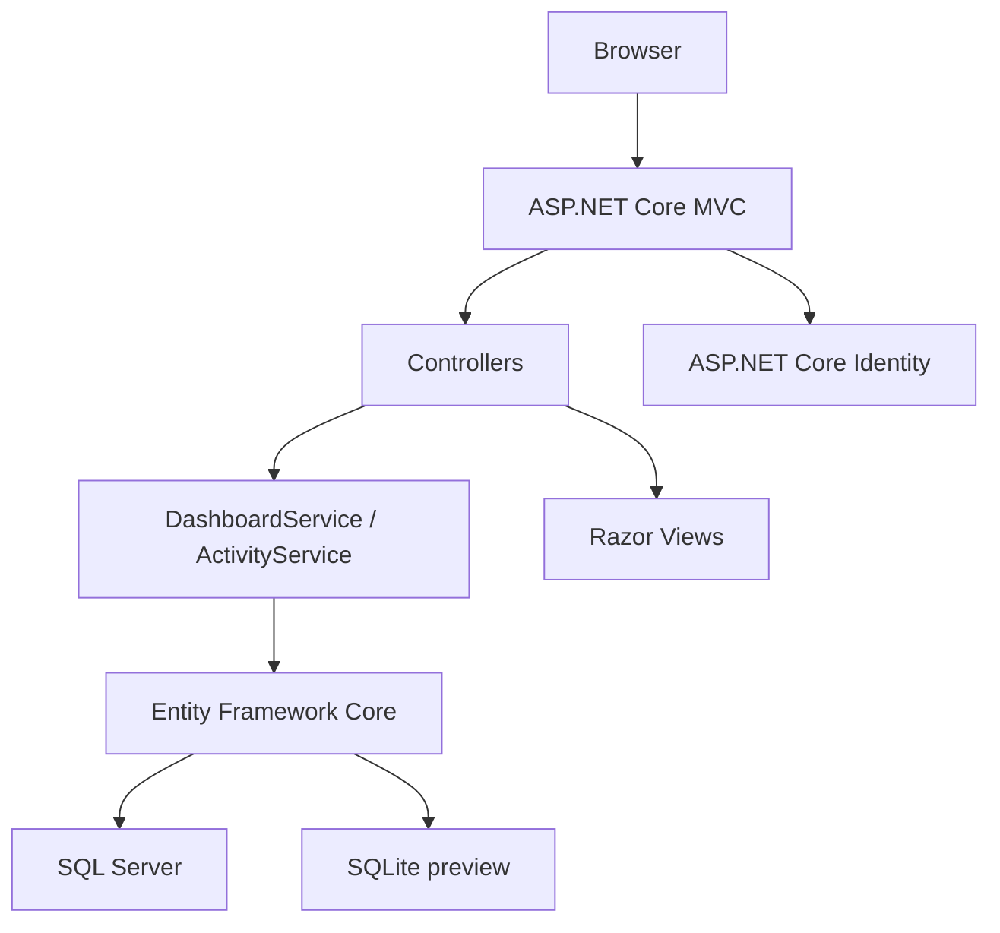
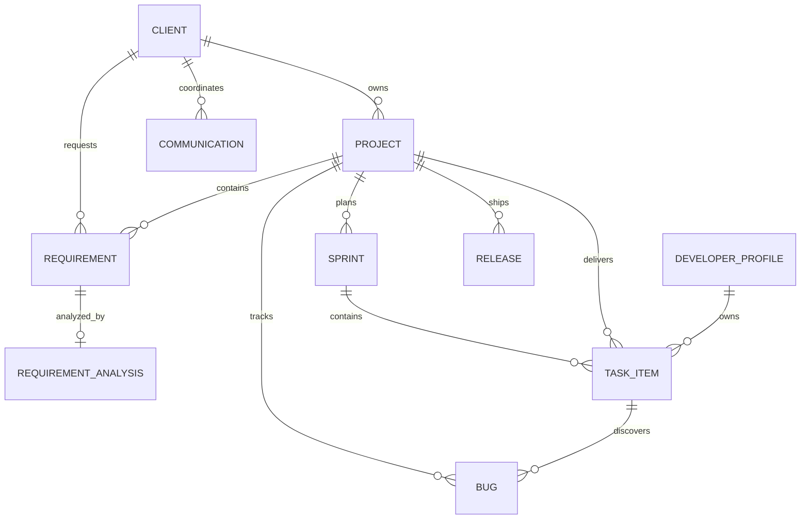

# DevTrack — Software Development & Project Management Platform

DevTrack is a portfolio-quality internal delivery workspace for a software company. It connects client coordination, requirement analysis, project planning, sprint execution, task ownership, quality triage, developer capacity, and release readiness in one workflow.

> Client requirement → analysis → project → sprint → task assignment → development → testing → bug fix → release

## Technology stack

The primary application is a real **C# / ASP.NET Core MVC / .NET 8** project. It uses Razor `.cshtml` views, Bootstrap 5, HTML5, CSS3, JavaScript, jQuery, Entity Framework Core, ASP.NET Core Identity, LINQ, dependency injection, async/await, and server-side validation. The application is configured for SQL Server through `DefaultConnection`; the sandbox preview defaults to SQLite so the full experience can run without a SQL Server instance.

| Layer | Implementation |
|---|---|
| Web | ASP.NET Core MVC with Razor Views |
| Data access | Entity Framework Core 8 with LINQ and async queries |
| Identity | ASP.NET Core Identity with role support |
| Database | SQL Server configuration plus SQLite preview provider |
| UI | Bootstrap 5, custom CSS, JavaScript, jQuery, Chart.js |
| Runtime | .NET 8 |

## Implemented capabilities

The dashboard reads its metrics from the EF Core data model and includes active projects, open requirements, active sprints, tasks in progress, unassigned tasks, open bugs, critical bugs, completed tasks, sprint completion rate, work distribution, project health, sprint progress, live activity, and quality attention items.

The application includes searchable and filterable views for projects, requirements, tasks, bugs, clients, developers, and releases. Projects can be created with server-side validation. Requirement status can move through the analysis lifecycle. Tasks enforce valid status transitions and write activity entries. Bugs support severity, ownership, status changes, and resolution timestamps. Developer workload views show assigned tasks, skills, availability, and capacity. Releases connect a version, project, target date, release status, and notes.

The seeded fictional workspace includes realistic client accounts such as Apex Health Systems, NovaCore Logistics, Vertex Financial Services, BlueOrbit Manufacturing, and GreenField Retail. It also includes project, sprint, task, bug, release, communication, activity, notification, and role data.

## Architecture



## Database design

The relational model contains users and roles, clients, projects, requirements, requirement analyses, sprints, tasks, developer profiles, bugs, releases, communications, activity logs, and notifications. Foreign keys connect the delivery hierarchy. Unique indexes protect business identifiers such as project codes, task codes, requirement codes, bug codes, and release codes.



## Run locally

Install the .NET 8 SDK, then restore and run the project from the repository root.

```bash
export PATH="$HOME/.dotnet:$PATH"
dotnet restore
dotnet build
dotnet run
```

The default local provider is SQLite and creates `devtrack.db` in the project root. The application runs the EF Core migration at startup and seeds the workspace on first run.

## SQL Server setup

Set `Database:Provider` to `sqlserver` and replace `ConnectionStrings:DefaultConnection` with a valid SQL Server connection string. Then start the application. EF Core migrations are located in `Migrations/` and can be applied with `dotnet ef database update`.

## Demo account

The seeded project manager account is `olivia.morgan@devtrack.local` with password `DevTrack123`. It is assigned to the `Project Manager` role. The application also creates the roles `Administrator`, `Project Manager`, `Developer`, `Tester`, and `Client`.

## Testing notes

The implementation includes business logic for valid task status transitions, requirement status updates, activity logging, role creation, server-side data annotations, anti-forgery tokens on state-changing forms, and EF Core relationships. The project is build-verified with `dotnet build`.

## Future enhancements

Natural next steps include full Identity login and registration screens, policy-based authorization on every module action, paginated server-side tables, a persisted comment model on each work item, notification read-state endpoints, formal integration tests, and a SQL Server CI pipeline.
