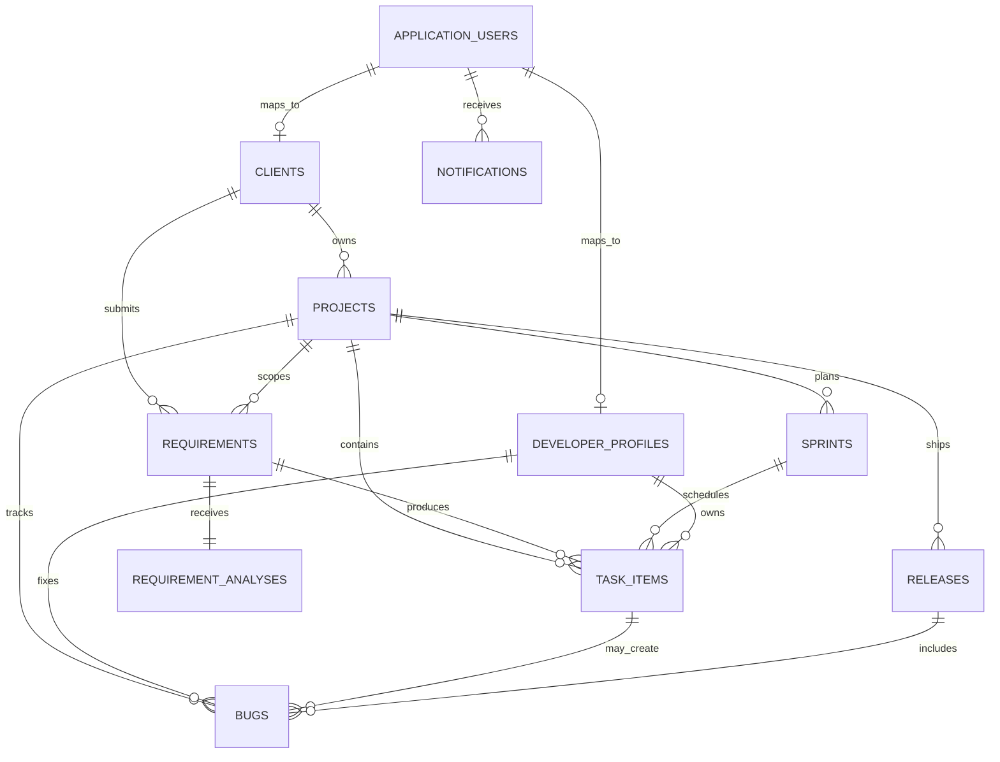

# DevTrack

DevTrack is an **ASP.NET Core MVC** application for following software delivery from a client requirement through analysis, project planning, sprint work, tasks, defects, and release preparation. It is designed as a portfolio-quality internal delivery workspace rather than as a generic CRUD sample.

## Problem statement and business objective

Software teams need an accountable record of why work exists, who owns it, how it progresses, and whether it is safe to release. DevTrack connects client organisations, projects, requirements, sprints, work items, developer capacity, defects, releases, client communications, audit activity, and user notifications in one relational model. Its business objective is to give project managers an operational view of delivery health while enforcing client-level data isolation.

## Implemented features

| Area | Implemented behaviour |
| --- | --- |
| Authentication and access control | ASP.NET Core Identity with individual account pages and the Administrator, Project Manager, Developer, Tester, and Client roles. Controllers use role-based `[Authorize]` policies. Client queries are restricted to the mapped client account. |
| Dashboard | Database-backed KPIs for active projects, open requirements, active sprints, work in progress, unassigned tasks, bugs, critical defects, completed work, and sprint completion. Four Chart.js visualisations use live EF Core query results. |
| Client coordination | Searchable, pageable client records with contact details, connected projects and requirements, and chronological communication records. |
| Project delivery | Project records link clients, requirements, sprints, tasks, defects, and releases. Project progress, status, priority, manager, and target dates are stored in SQL Server. |
| Requirement analysis | Requirements include business value, type, priority, due date, accountable manager, and a dedicated analysis record for objective, functional/non-functional requirements, acceptance criteria, dependencies, risks, estimated effort, and technical notes. Managers can approve or reject analysis. |
| Sprints and tasks | Scrum-style sprints show committed tasks and story points. Task status updates are checked by a workflow service to prevent invalid state jumps. Managers can assign work to developer profiles. |
| Quality and releases | Testers, managers, and administrators can record defects. Valid bug transitions support assignment, implementation, testing, closure, and reopening. Releases track project version, target date, notes, status, and linked bugs. |
| Collaboration and audit | jQuery posts anti-forgery-protected asynchronous comments to related task or defect records. The application records delivery activity such as requirement approval, task assignment, task state changes, bug creation, and release planning. |

## Technology stack

The project contains only the technologies implemented in this repository.

| Layer | Implementation |
| --- | --- |
| Application | C#, .NET 8, ASP.NET Core MVC, Razor Views, dependency injection, async/await |
| Identity | ASP.NET Core Identity, Identity UI, role management, authorization attributes |
| Data | Entity Framework Core 8, LINQ, SQL Server provider, migrations, foreign keys, unique indexes, precision configuration |
| Front end | Razor `.cshtml`, Bootstrap 5, CSS3, JavaScript, jQuery, jQuery Validation, Chart.js |
| Tests | xUnit workflow tests |

## Architecture

The MVC controllers receive requests, coordinate database work through `ApplicationDbContext` and focused services, and return strongly typed Razor views. `DashboardService` aggregates delivery metrics; `WorkflowService` centralises valid task and bug status transitions; `ActivityLogService` records audit entries. ASP.NET Core Identity owns authentication and role assignment.

```text
Razor view → MVC controller → service / ApplicationDbContext → EF Core SQL Server provider → SQL Server
```

## Database design

The SQL Server migration is stored under `Migrations/`. It creates Identity tables plus the DevTrack domain tables, indexed for normal delivery queries. The initial migration was verified by generating an idempotent SQL Server script locally; it was **not applied to a SQL Server instance in this environment** because no database server or credentials were supplied.



## Installation and SQL Server setup

Install the .NET 8 SDK and provision a SQL Server instance that the application host can reach. Do not commit passwords or connection strings with real credentials.

```bash
git clone <repository-url>
cd devtrack-aspnet-core-mvc
dotnet restore
dotnet user-secrets set "ConnectionStrings:DefaultConnection" "Server=localhost,1433;Database=DevTrack;User Id=sa;Password=YOUR_STRONG_PASSWORD;TrustServerCertificate=True;MultipleActiveResultSets=true"
dotnet user-secrets set "DemoSeed:Password" "ChooseASeparateStrongPassword!"
dotnet user-secrets set "SeedDemoData" "true"
dotnet ef database update
dotnet run --project DevTrack.csproj
```

The checked-in `appsettings.json` contains a non-working placeholder connection string to document the expected SQL Server configuration. Override it through user secrets, environment variables, or your deployment configuration before running migrations.

### Optional demo data

When `SeedDemoData` is set to `true` and a valid `DemoSeed:Password` secret is configured, startup provisions the five roles and creates the following accounts on an empty database:

| Role | Email |
| --- | --- |
| Administrator | `admin@devtrack.local` |
| Project Manager | `manager@devtrack.local` |
| Developer | `developer@devtrack.local` |
| Tester | `tester@devtrack.local` |
| Client | `client@devtrack.local` |

All generated accounts use the password supplied through `DemoSeed:Password`; no seed password is stored in source control.

## Validation and tests

Server-side model attributes validate required fields, email addresses, maximum lengths, numeric ranges, and dates. Razor forms include jQuery Validation. Task and bug transitions are additionally validated by `WorkflowService`.

The repository contains `Tests/DevTrack.Tests`, an xUnit project covering permitted and prohibited task and defect transitions. The suite was run locally with **19 passing tests**. Build verification completed with `dotnet build DevTrack.sln` and no warnings or errors.

## Screenshots

Run the application against a configured SQL Server database, sign in, and use the dashboard, portfolio, requirements, sprint, task, bug, release, and reporting pages. Screenshots are intentionally not embedded because this environment did not have an executable SQL Server instance for a live authenticated session.

## Future enhancements

Useful next steps include controller integration tests backed by an isolated test database, granular policy handlers, file attachments, a notification centre UI, email delivery, richer reporting exports, and deployment configuration.
